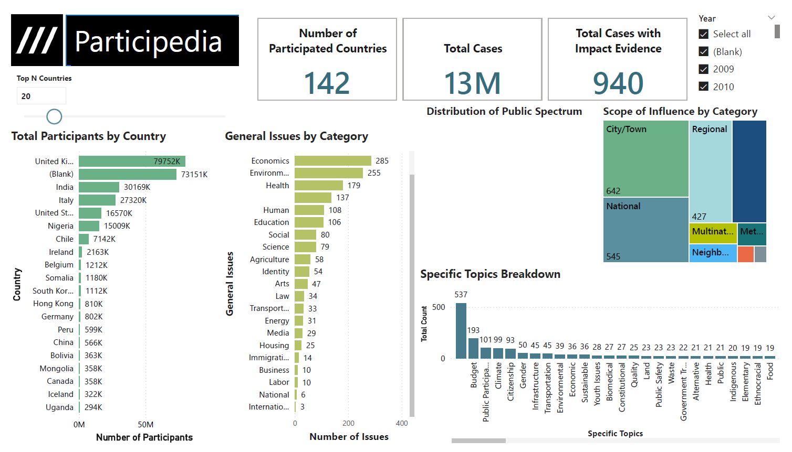

# 📊 Participedia Public Participation Dashboard

This Power BI dashboard was developed using public datasets from [Participedia.net](https://participedia.net/), focusing on **Cases**, **Methods**, and **Organizations** used in participatory democracy projects worldwide.

## 🔍 Project Overview
Participedia is an open platform that crowdsources and organizes information about public participation and democratic innovations around the globe. Using three CSV data exports—**Cases**, **Methods**, and **Organizations**—this dashboard analyzes:

- Total number of participants by country
- General and specific issues addressed
- Scope of influence
- Number of cases with impact evidence
- Specific topics like Budgeting, Climate, Health, etc.

## 🧰 Tools & Techniques
- **Power BI**
- Data Cleaning & Transformation in Power BI Query Editor
- DAX for measures and KPIs

## 📈 Key Visuals
- **Bar charts** showing participant distribution by country and issue
- **Tree map** of scope of influence
- **KPI cards** displaying total countries, cases, and impact evidence
- **Topic-wise breakdowns** of participatory trends

## 🖼️ Dashboard Preview

## 📁 Files
- [`Participedia_Case_Analysis.pbix`](./Participedia_Analysis.pbix) — Power BI project file
- `Dashboard.png` — Screenshot of final dashboard

## 📊 Insights Derived
- The UK and India are among the top countries in terms of total participant counts.
- Most documented issues fall under **Economics**, **Environment**, and **Health**.
- Many cases show evidence of impact, especially at **City/Town** and **National** levels.
- Budgeting is the most common specific topic across cases.

## 👨‍💻 About the Developer

I'm **Krishna Kanth Reddy**, a Business Intelligence Analyst with 4+ years of experience in SQL, ETL, Power BI, and Python. Recently completed my MPS in Analytics from Northeastern University.

- 📧 krishnakanthreddycan@gmail.com  
- 🔗 [LinkedIn](https://linkedin.com/in/krishnakrk)

